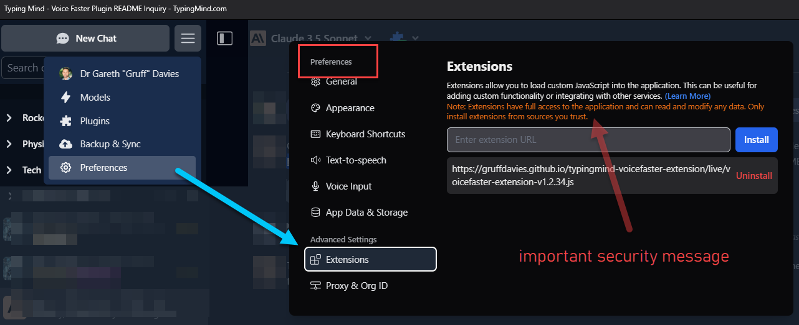

# Voice Faster Extension and Plugin For TypingMind

## Purpose

VoiceFaster is an extension and plugin for [TypingMind](https://docs.typingmind.com/) that work together to provide a faster voice to text experience for TypingMind.

The plugin constructs a web request to call ElevenLabs API using the streaming API for the voice.
The Extension renders an audio player in a sandboxed iFrame in the TypingMind UI (whether chrome or installed as a web app).
The extension handles making (but not constructing) streaming web requests to the ElevenLabs API and handling the responses.
It has a queue and receives request payloads from the plugin.

Set the live extension in the menu > settings > Advanced Settings > Extensions

### Important

- Live Extensions Are Injected Into The Browser and run immediately.
- Use with extreme caution!
- This code is an experiment and not written for other users and may change at any time.
- You are welcome to fork this repo if you find it useful and are strongly advised to use your own fork.
- Check the code thoroughly before using it.
- This is 100% unsupported and you use it at your own risk.

The repo uses GitHub Pages to publish the code in a way that makes the raw code visible publically.

## Repo URIs vs raw code URIs

The repo's root web URI is : [https://github.com/gruffdavies/typingmind-voicefaster-extension]

Use this to understand the code and repo structure.

To read or use the raw code, instead use the following URI form:
`https://gruffdavies.github.io/typingmind-voicefaster-extension/{path}{filename}`

e.g.

1. readme [https://gruffdavies.github.io/typingmind-voicefaster-extension/README.md]
2. live [https://gruffdavies.github.io/typingmind-voicefaster-extension/live/voicefaster-extension-{SEMVER}.js]
3. test [https://gruffdavies.github.io/typingmind-voicefaster-extension/test/voicefaster-extension-{SEMVER}.js]
4. dev (extension) [https://gruffdavies.github.io/typingmind-voicefaster-extension/extension/voicefaster-extension.js]
5. dev (plugin) [https://gruffdavies.github.io/typingmind-voicefaster-extension/plugin/voicefaster-plugin.js]

## IMPORTANT

- Live Extensions Are Injected Into The Browser and run immediately.
- Use with caution!
- Currently the live extension and plugin versions are unrelated. See [[Dev]].

## Live URIs

1. More than one version of the extension can be live at the same time.
2. The version number is the semantic version of the extension.
3. The version number in the URI should be the same as the version number in the code (but mistakes happen, so this is not guaranteed).
4. A copy of the plugin code is in comments in the extension code along with its version.
5. That version is tested to work with the extension. Later versions may not work.

## Test Versions

NB: Test versions are also visible publically and can be used to test versions of the extension.
Note to see the public version of the test files replace `live` with `test` in the .io URI.

## Dev Versions

The dev version of the extension and plugin code are in the extension and plugin folders respectively.
They may not work unless the SEMVER version in the URI matches the version in the code (or even then).
Check the code is the same as the version in the URI to be sure.
Note to see the public version of the dev files replace `live` with `extension` or `plugin` in the .io URI.
