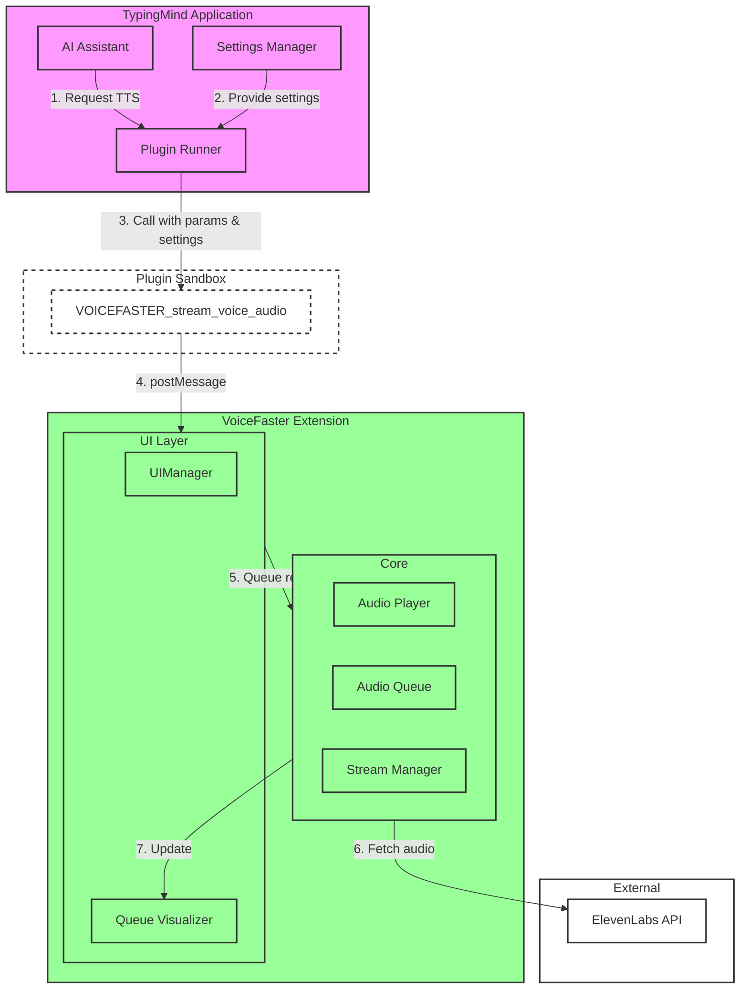
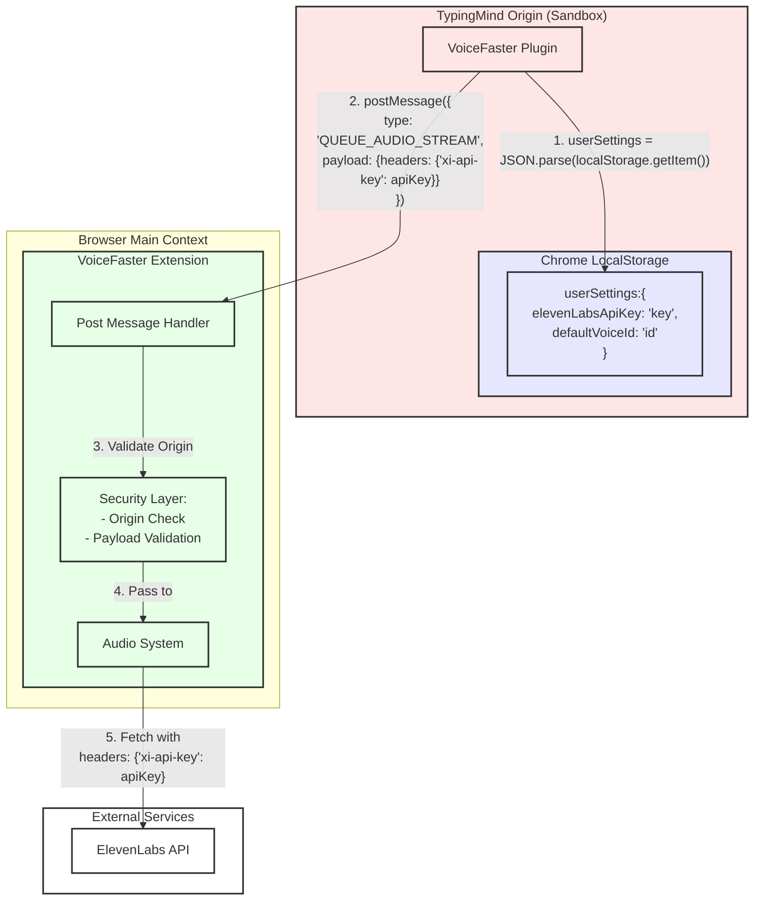
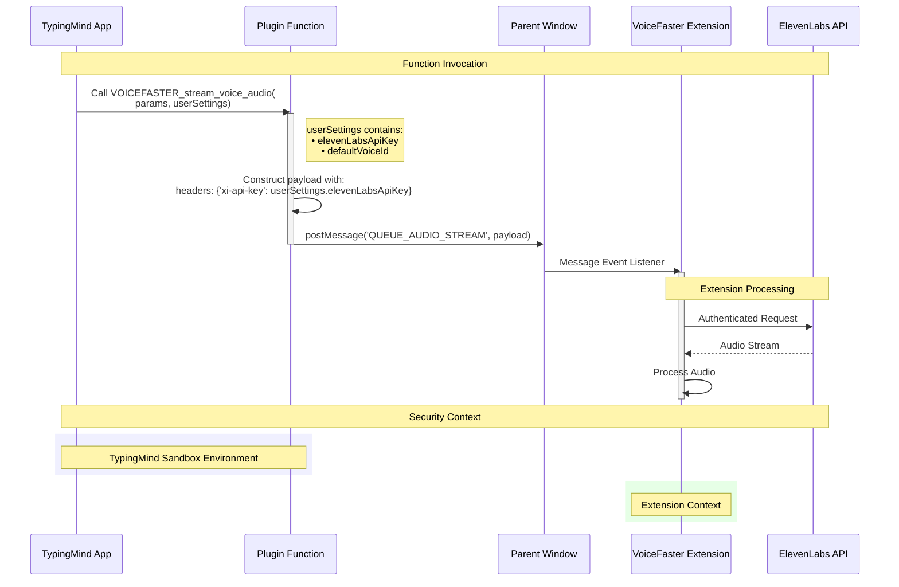
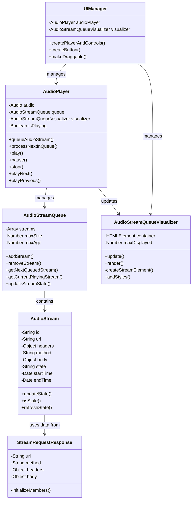
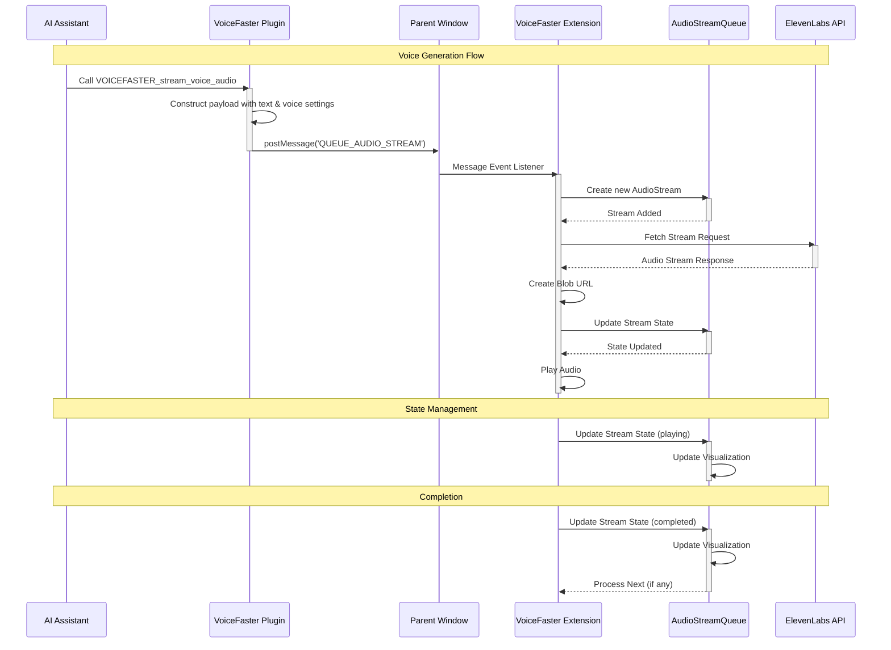
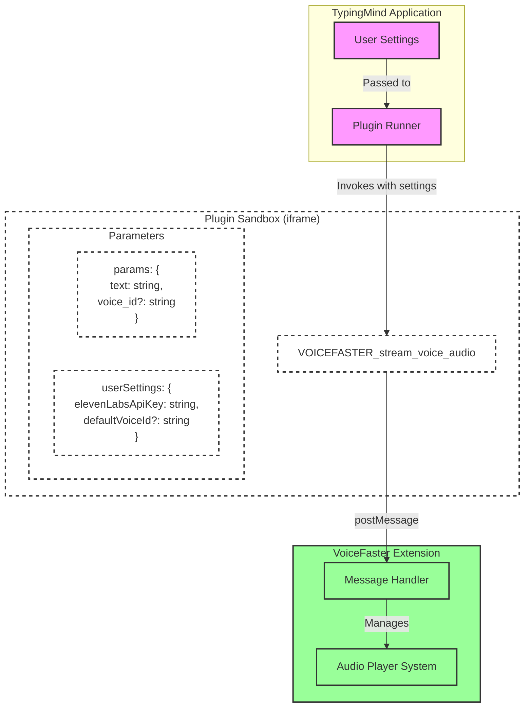

# Design Diagrams

## Overview

## Data storage and Security architecture

## security boundaries and data access

## v1.3.1 Voice Faster Extension IIFE TTS)

### PLugin and Extension Interaction Sequence Diagram

## detailed plugin structure

