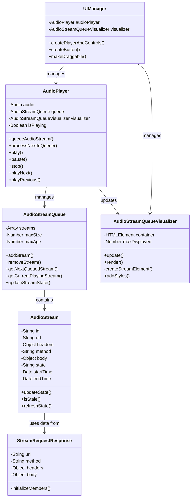

# Design Diagrams

## v1.3.1 Voice Faster Extension IIFE TTS)

```mermaid
classDiagram
    class UIManager {
        -AudioPlayer audioPlayer
        -AudioStreamQueueVisualizer visualizer
        +createPlayerAndControls()
        +createButton()
        +makeDraggable()
    }

    class AudioPlayer {
        -Audio audio
        -AudioStreamQueue queue
        -AudioStreamQueueVisualizer visualizer
        -Boolean isPlaying
        +queueAudioStream()
        +processNextInQueue()
        +play()
        +pause()
        +stop()
        +playNext()
        +playPrevious()
    }

    class AudioStreamQueue {
        -Array streams
        -Number maxSize
        -Number maxAge
        +addStream()
        +removeStream()
        +getNextQueuedStream()
        +getCurrentPlayingStream()
        +updateStreamState()
    }

    class AudioStream {
        -String id
        -String url
        -Object headers
        -String method
        -Object body
        -String state
        -Date startTime
        -Date endTime
        +updateState()
        +isStale()
        +refreshState()
    }

    class AudioStreamQueueVisualizer {
        -HTMLElement container
        -Number maxDisplayed
        +update()
        +render()
        -createStreamElement()
        +addStyles()
    }

    class StreamRequestResponse {
        -String url
        -String method
        -Object headers
        -Object body
        -initializeMembers()
    }

    UIManager --> AudioPlayer : manages
    UIManager --> AudioStreamQueueVisualizer : manages
    AudioPlayer --> AudioStreamQueue : manages
    AudioPlayer --> AudioStreamQueueVisualizer : updates
    AudioStreamQueue --> AudioStream : contains
    AudioStream --> StreamRequestResponse : uses data from
```
