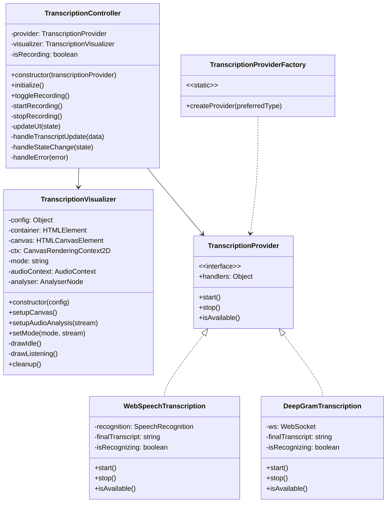
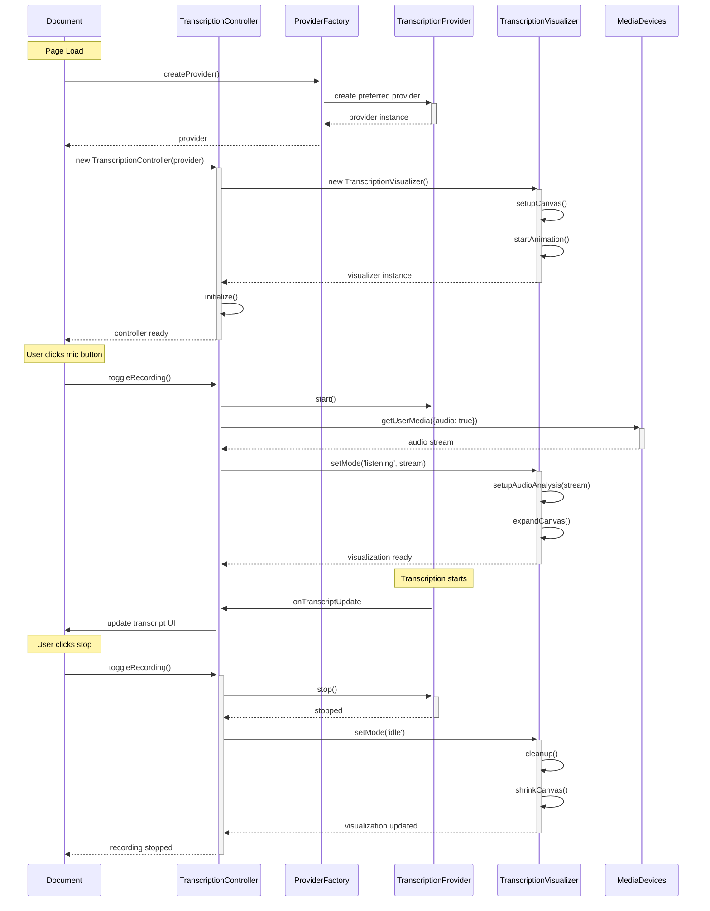

# Version 2.1 Design Notes

## Classs Diagram

```mermaid
classDiagram
    class TranscriptionController {
        -provider: TranscriptionProvider
        -visualizer: TranscriptionVisualizer
        -isRecording: boolean
        +constructor(transcriptionProvider)
        +initialize()
        +toggleRecording()
        -startRecording()
        -stopRecording()
        -updateUI(state)
        -handleTranscriptUpdate(data)
        -handleStateChange(state)
        -handleError(error)
    }

    class TranscriptionVisualizer {
        -config: Object
        -container: HTMLElement
        -canvas: HTMLCanvasElement
        -ctx: CanvasRenderingContext2D
        -mode: string
        -audioContext: AudioContext
        -analyser: AnalyserNode
        +constructor(config)
        +setupCanvas()
        +setupAudioAnalysis(stream)
        +setMode(mode, stream)
        -drawIdle()
        -drawListening()
        +cleanup()
    }

    class TranscriptionProvider {
        &lt;&lt;interface&gt;&gt;
        +start()
        +stop()
        +isAvailable()
        +handlers: Object
    }

    class WebSpeechTranscription {
        -recognition: SpeechRecognition
        -finalTranscript: string
        -isRecognizing: boolean
        +start()
        +stop()
        +isAvailable()
    }

    class DeepGramTranscription {
        -ws: WebSocket
        -finalTranscript: string
        -isRecognizing: boolean
        +start()
        +stop()
        +isAvailable()
    }

    class TranscriptionProviderFactory {
        &lt;&lt;static&gt;&gt;
        +createProvider(preferredType)
    }

    TranscriptionController --> TranscriptionVisualizer
    TranscriptionController --> TranscriptionProvider
    TranscriptionProvider <|.. WebSpeechTranscription
    TranscriptionProvider <|.. DeepGramTranscription
    TranscriptionProviderFactory ..> TranscriptionProvider

```

## Sequence Diagram

```mermaid
sequenceDiagram
    participant DOM as Document
    participant TC as TranscriptionController
    participant PF as ProviderFactory
    participant P as TranscriptionProvider
    participant V as TranscriptionVisualizer
    participant Media as MediaDevices

    Note over DOM: Page Load
    DOM->>+PF: createProvider()
    PF->>+P: create preferred provider
    P-->>-PF: provider instance
    PF-->>DOM: provider

    DOM->>+TC: new TranscriptionController(provider)
    TC->>+V: new TranscriptionVisualizer()
    V->>V: setupCanvas()
    V->>V: startAnimation()
    V-->>-TC: visualizer instance
    TC->>TC: initialize()
    TC-->>-DOM: controller ready

    Note over DOM: User clicks mic button
    DOM->>+TC: toggleRecording()
    TC->>+P: start()
    TC->>+Media: getUserMedia({audio: true})
    Media-->>-TC: audio stream
    TC->>+V: setMode('listening', stream)
    V->>V: setupAudioAnalysis(stream)
    V->>V: expandCanvas()
    V-->>-TC: visualization ready

    Note over P: Transcription starts
    P->>TC: onTranscriptUpdate
    TC->>DOM: update transcript UI

    Note over DOM: User clicks stop
    DOM->>+TC: toggleRecording()
    TC->>+P: stop()
    P-->>-TC: stopped
    TC->>+V: setMode('idle')
    V->>V: cleanup()
    V->>V: shrinkCanvas()
    V-->>-TC: visualization updated
    TC-->>-DOM: recording stopped
```