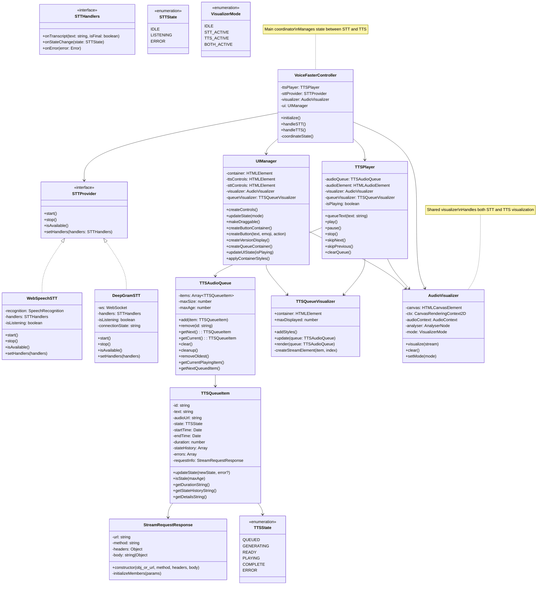

# 2.3.2

```mermaid
classDiagram
    %% Core Controller
    class VoiceFasterController {
        -ttsPlayer: TTSPlayer
        -sttProvider: STTProvider
        -visualizer: AudioVisualizer
        -ui: UIManager
        +initialize()
        +handleSTT()
        +handleTTS()
        -coordinateState()
    }

    %% STT (Speech-to-Text) Classes
    class STTProvider {
        <<interface>>
        +start()
        +stop()
        +isAvailable()
        +setHandlers(handlers: STTHandlers)
    }

    class STTHandlers {
        <<interface>>
        +onTranscript(text: string, isFinal: boolean)
        +onStateChange(state: STTState)
        +onError(error: Error)
    }

    class WebSpeechSTT {
        -recognition: SpeechRecognition
        -handlers: STTHandlers
        -isListening: boolean
        +start()
        +stop()
        +isAvailable()
        +setHandlers(handlers)
    }

    class DeepGramSTT {
        -ws: WebSocket
        -handlers: STTHandlers
        -isListening: boolean
        -connectionState: string
        +start()
        +stop()
        +isAvailable()
        +setHandlers(handlers)
    }

    %% TTS (Text-to-Speech) Classes
    class StreamRequestResponse {
        -url: string
        -method: string
        -headers: Object
        -body: string|Object
        +constructor(obj_or_url, method, headers, body)
        -initializeMembers(params)
    }

    class TTSPlayer {
        -audioQueue: TTSAudioQueue
        -audioElement: HTMLAudioElement
        -visualizer: AudioVisualizer
        -queueVisualizer: TTSQueueVisualizer
        -isPlaying: boolean
        +queueText(text: string)
        +play()
        +pause()
        +stop()
        +skipNext()
        +skipPrevious()
        +clearQueue()
    }

    class TTSAudioQueue {
        -items: Array~TTSQueueItem~
        -maxSize: number
        -maxAge: number
        +add(item: TTSQueueItem)
        +remove(id: string)
        +getNext(): TTSQueueItem
        +getCurrent(): TTSQueueItem
        +clear()
        +cleanup()
        +removeOldest()
        +getCurrentPlayingItem()
        +getNextQueuedItem()
    }

    class TTSQueueItem {
        -id: string
        -text: string
        -audioUrl: string
        -state: TTSState
        -startTime: Date
        -endTime: Date
        -duration: number
        -stateHistory: Array
        -errors: Array
        -requestInfo: StreamRequestResponse
        +updateState(newState, error?)
        +isStale(maxAge)
        +getDurationString()
        +getStateHistoryString()
        +getDetailsString()
    }

    class TTSQueueVisualizer {
        +container: HTMLElement
        +maxDisplayed: number
        +addStyles()
        +update(queue: TTSAudioQueue)
        +render(queue: TTSAudioQueue)
        -createStreamElement(item, index)
    }

    %% Shared Components
    class AudioVisualizer {
        -canvas: HTMLCanvasElement
        -ctx: CanvasRenderingContext2D
        -audioContext: AudioContext
        -analyser: AnalyserNode
        -mode: VisualizerMode
        +visualize(stream)
        +clear()
        +setMode(mode)
    }

    class UIManager {
        -container: HTMLElement
        -ttsControls: HTMLElement
        -sttControls: HTMLElement
        -visualizer: AudioVisualizer
        -queueVisualizer: TTSQueueVisualizer
        +createControls()
        +updateState(mode)
        +makeDraggable()
        +createButtonContainer()
        +createButton(text, emoji, action)
        +createVersionDisplay()
        +createQueueContainer()
        +updateUIState(isPlaying)
        +applyContainerStyles()
    }

    %% Enums
    class STTState {
        <<enumeration>>
        IDLE
        LISTENING
        ERROR
    }

    class TTSState {
        <<enumeration>>
        QUEUED
        GENERATING
        READY
        PLAYING
        COMPLETE
        ERROR
    }

    class VisualizerMode {
        <<enumeration>>
        IDLE
        STT_ACTIVE
        TTS_ACTIVE
        BOTH_ACTIVE
    }

    %% Relationships
    VoiceFasterController --> UIManager
    VoiceFasterController --> TTSPlayer
    VoiceFasterController --> STTProvider
    VoiceFasterController --> AudioVisualizer

    STTProvider <|.. WebSpeechSTT
    STTProvider <|.. DeepGramSTT

    TTSPlayer --> TTSAudioQueue
    TTSPlayer --> AudioVisualizer
    TTSPlayer --> TTSQueueVisualizer
    TTSAudioQueue --> TTSQueueItem
    TTSQueueItem --> StreamRequestResponse
    TTSQueueItem --> TTSState

    UIManager --> TTSQueueVisualizer
    UIManager --> AudioVisualizer

    note for VoiceFasterController "Main coordinator\nManages state between STT and TTS"
    note for AudioVisualizer "Shared visualizer\nHandles both STT and TTS visualization"
```