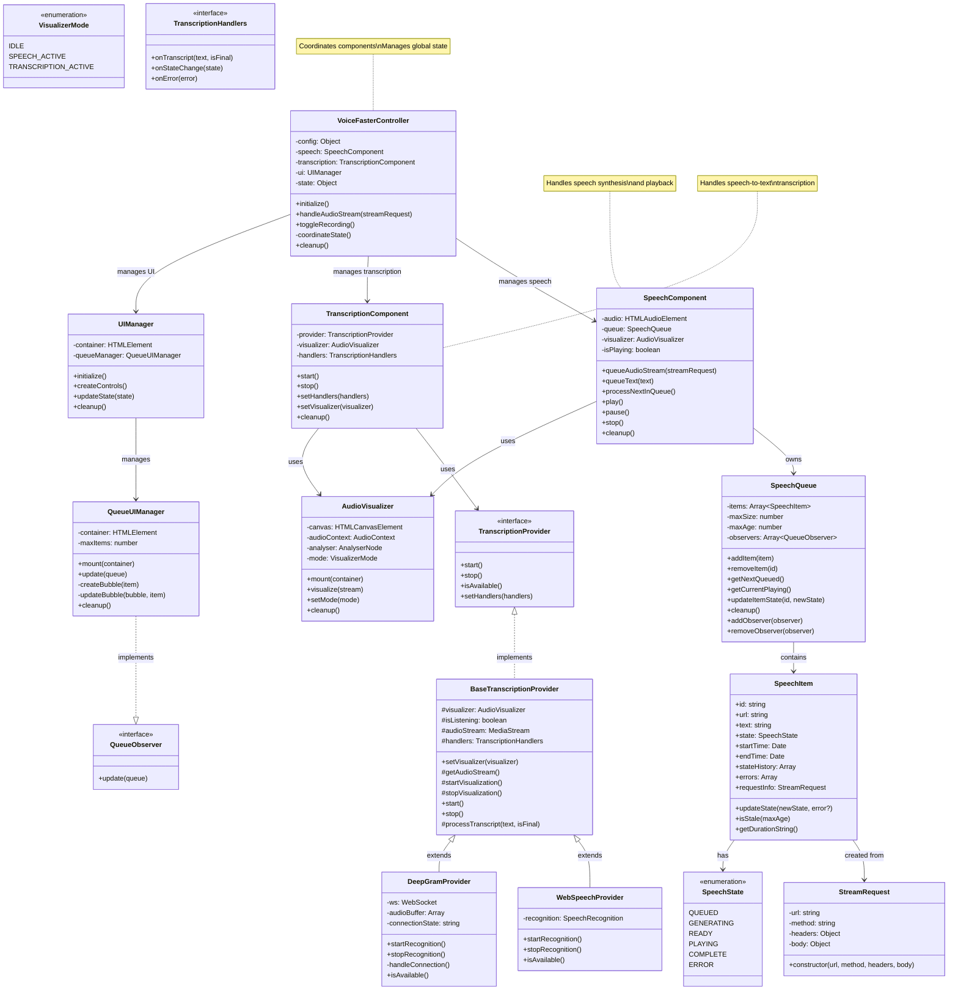

# VoiceFaster v2.3.3

```mermaid
classDiagram
    %% Core Controller
    class VoiceFasterController {
        -config: Object
        -speech: SpeechComponent
        -transcription: TranscriptionComponent
        -ui: UIManager
        -state: Object
        +initialize()
        +handleAudioStream(streamRequest)
        +toggleRecording()
        -coordinateState()
        +cleanup()
    }

    %% Speech Domain
    class SpeechComponent {
        -audio: HTMLAudioElement
        -queue: SpeechQueue
        -visualizer: AudioVisualizer
        -isPlaying: boolean
        +queueAudioStream(streamRequest)
        +queueText(text)
        +processNextInQueue()
        +play()
        +pause()
        +stop()
        +cleanup()
    }

    class SpeechQueue {
        -items: Array~SpeechItem~
        -maxSize: number
        -maxAge: number
        -observers: Array~QueueObserver~
        +addItem(item)
        +removeItem(id)
        +getNextQueued()
        +getCurrentPlaying()
        +updateItemState(id, newState)
        +cleanup()
        +addObserver(observer)
        +removeObserver(observer)
    }

    class SpeechItem {
        +id: string
        +url: string
        +text: string
        +state: SpeechState
        +startTime: Date
        +endTime: Date
        +stateHistory: Array
        +errors: Array
        +requestInfo: StreamRequest
        +updateState(newState, error?)
        +isStale(maxAge)
        +getDurationString()
    }

    class StreamRequest {
        -url: string
        -method: string
        -headers: Object
        -body: Object
        +constructor(url, method, headers, body)
    }

    %% Transcription Domain
    class TranscriptionComponent {
        -provider: TranscriptionProvider
        -visualizer: AudioVisualizer
        -handlers: TranscriptionHandlers
        +start()
        +stop()
        +setHandlers(handlers)
        +setVisualizer(visualizer)
        +cleanup()
    }

    class TranscriptionProvider {
        <<interface>>
        +start()
        +stop()
        +isAvailable()
        +setHandlers(handlers)
    }

    class BaseTranscriptionProvider {
        #visualizer: AudioVisualizer
        #isListening: boolean
        #audioStream: MediaStream
        #handlers: TranscriptionHandlers
        +setVisualizer(visualizer)
        #getAudioStream()
        #startVisualization()
        #stopVisualization()
        +start()
        +stop()
        #processTranscript(text, isFinal)
    }

    class WebSpeechProvider {
        -recognition: SpeechRecognition
        +startRecognition()
        +stopRecognition()
        +isAvailable()
    }

    class DeepGramProvider {
        -ws: WebSocket
        -audioBuffer: Array
        -connectionState: string
        +startRecognition()
        +stopRecognition()
        -handleConnection()
        +isAvailable()
    }

    %% UI Domain
    class UIManager {
        -container: HTMLElement
        -queueManager: QueueUIManager
        +initialize()
        +createControls()
        +updateState(state)
        +cleanup()
    }

    class QueueUIManager {
        -container: HTMLElement
        -maxItems: number
        +mount(container)
        +update(queue)
        -createBubble(item)
        -updateBubble(bubble, item)
        +cleanup()
    }

    %% Visualization
    class AudioVisualizer {
        -canvas: HTMLCanvasElement
        -audioContext: AudioContext
        -analyser: AnalyserNode
        -mode: VisualizerMode
        +mount(container)
        +visualize(stream)
        +setMode(mode)
        +cleanup()
    }

    %% Enums and Interfaces
    class SpeechState {
        <<enumeration>>
        QUEUED
        GENERATING
        READY
        PLAYING
        COMPLETE
        ERROR
    }

    class VisualizerMode {
        <<enumeration>>
        IDLE
        SPEECH_ACTIVE
        TRANSCRIPTION_ACTIVE
    }

    class TranscriptionHandlers {
        <<interface>>
        +onTranscript(text, isFinal)
        +onStateChange(state)
        +onError(error)
    }

    class QueueObserver {
        <<interface>>
        +update(queue)
    }

    %% Relationships
    VoiceFasterController --> SpeechComponent : manages speech
    VoiceFasterController --> TranscriptionComponent : manages transcription
    VoiceFasterController --> UIManager : manages UI

    SpeechComponent --> SpeechQueue : owns
    SpeechComponent --> AudioVisualizer : uses
    SpeechQueue --> SpeechItem : contains
    SpeechItem --> StreamRequest : created from
    SpeechItem --> SpeechState : has

    TranscriptionComponent --> TranscriptionProvider : uses
    TranscriptionComponent --> AudioVisualizer : uses
    TranscriptionProvider <|.. BaseTranscriptionProvider : implements
    BaseTranscriptionProvider <|-- WebSpeechProvider : extends
    BaseTranscriptionProvider <|-- DeepGramProvider : extends

    UIManager --> QueueUIManager : manages
    QueueUIManager ..|> QueueObserver : implements

    note for VoiceFasterController "Coordinates components\nManages global state"
    note for SpeechComponent "Handles speech synthesis\nand playback"
    note for TranscriptionComponent "Handles speech-to-text\ntranscription"
```