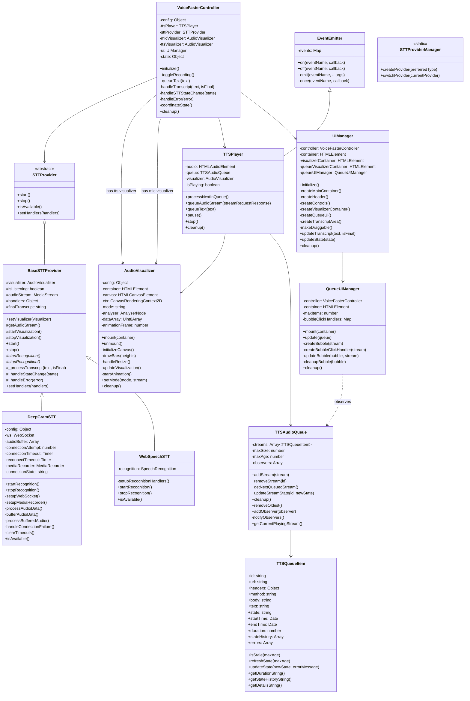

```mermaid
classDiagram
    %% Core Event System
    class EventEmitter {
        -events: Map
        +on(eventName, callback)
        +off(eventName, callback)
        +emit(eventName, ...args)
        +once(eventName, callback)
    }

    %% Core Controller
    class VoiceFasterController {
        -config: Object
        -ttsPlayer: TTSPlayer
        -sttProvider: STTProvider
        -micVisualizer: AudioVisualizer
        -ttsVisualizer: AudioVisualizer
        -ui: UIManager
        -state: Object
        +initialize()
        +toggleRecording()
        +queueText(text)
        -handleTranscript(text, isFinal)
        -handleSTTStateChange(state)
        -handleError(error)
        -coordinateState()
        +cleanup()
    }

    %% Provider Manager
    class STTProviderManager {
        <<static>>
        +createProvider(preferredType)
        +switchProvider(currentProvider)
    }

    %% STT Classes
    class STTProvider {
        <<abstract>>
        +start()
        +stop()
        +isAvailable()
        +setHandlers(handlers)
    }

    class BaseSTTProvider {
        #visualizer: AudioVisualizer
        #isListening: boolean
        #audioStream: MediaStream
        #handlers: Object
        #finalTranscript: string
        +setVisualizer(visualizer)
        #getAudioStream()
        #startVisualization()
        #stopVisualization()
        +start()
        +stop()
        #startRecognition()*
        #stopRecognition()*
        #_processTranscript(text, isFinal)
        #_handleStateChange(state)
        #_handleError(error)
        +setHandlers(handlers)
    }

    class WebSpeechSTT {
        -recognition: SpeechRecognition
        -setupRecognitionHandlers()
        +startRecognition()
        +stopRecognition()
        +isAvailable()
    }

    class DeepGramSTT {
        -config: Object
        -ws: WebSocket
        -audioBuffer: Array
        -connectionAttempt: number
        -connectionTimeout: Timer
        -reconnectTimeout: Timer
        -mediaRecorder: MediaRecorder
        -connectionState: string
        +startRecognition()
        +stopRecognition()
        -setupWebSocket()
        -setupMediaRecorder()
        -processAudioData()
        -bufferAudioData()
        -processBufferedAudio()
        -handleConnectionFailure()
        -clearTimeouts()
        +isAvailable()
    }

    %% Audio Visualization
    class AudioVisualizer {
        -config: Object
        -container: HTMLElement
        -canvas: HTMLCanvasElement
        -ctx: CanvasRenderingContext2D
        -mode: string
        -analyser: AnalyserNode
        -dataArray: Uint8Array
        -animationFrame: number
        +mount(container)
        +unmount()
        -initializeCanvas()
        -drawBars(heights)
        -handleResize()
        -updateVisualization()
        -startAnimation()
        +setMode(mode, stream)
        +cleanup()
    }

    %% UI Components
    class UIManager {
        -controller: VoiceFasterController
        -container: HTMLElement
        -visualizerContainer: HTMLElement
        -queueVisualizerContainer: HTMLElement
        -queueUIManager: QueueUIManager
        +initialize()
        -createMainContainer()
        -createHeader()
        -createControls()
        -createVisualizerContainer()
        -createQueueUI()
        -createTranscriptArea()
        -makeDraggable()
        +updateTranscript(text, isFinal)
        +updateState(state)
        +cleanup()
    }

    class QueueUIManager {
        -controller: VoiceFasterController
        -container: HTMLElement
        -maxItems: number
        -bubbleClickHandlers: Map
        +mount(container)
        +update(queue)
        -createBubble(stream)
        -createBubbleClickHandler(stream)
        -updateBubble(bubble, stream)
        -cleanupBubble(bubble)
        +cleanup()
    }

    %% TTS Components
    class TTSPlayer {
        -audio: HTMLAudioElement
        -queue: TTSAudioQueue
        -visualizer: AudioVisualizer
        -isPlaying: boolean
        +processNextInQueue()
        +queueAudioStream(streamRequestResponse)
        +queueText(text)
        +pause()
        +stop()
        +cleanup()
    }

    class TTSAudioQueue {
        -streams: Array~TTSQueueItem~
        -maxSize: number
        -maxAge: number
        -observers: Array
        +addStream(stream)
        +removeStream(id)
        +getNextQueuedStream()
        +updateStreamState(id, newState)
        +cleanup()
        +removeOldest()
        +addObserver(observer)
        -notifyObservers()
        +getCurrentPlayingStream()
    }

    class TTSQueueItem {
        +id: string
        +url: string
        +headers: Object
        +method: string
        +body: string
        +text: string
        +state: string
        +startTime: Date
        +endTime: Date
        +duration: number
        +stateHistory: Array
        +errors: Array
        +isStale(maxAge)
        +refreshState(maxAge)
        +updateState(newState, errorMessage)
        +getDurationString()
        +getStateHistoryString()
        +getDetailsString()
    }

    %% Inheritance Relationships
    EventEmitter <|-- TTSPlayer
    STTProvider <|-- BaseSTTProvider
    BaseSTTProvider <|-- WebSpeechSTT
    BaseSTTProvider <|-- DeepGramSTT

    %% Composition/Association Relationships
    VoiceFasterController --> UIManager
    VoiceFasterController --> TTSPlayer
    VoiceFasterController --> AudioVisualizer : has mic visualizer
    VoiceFasterController --> AudioVisualizer : has tts visualizer
    VoiceFasterController --> STTProvider
    UIManager --> QueueUIManager
    TTSPlayer --> TTSAudioQueue
    TTSPlayer --> AudioVisualizer
    TTSAudioQueue --> TTSQueueItem
    QueueUIManager ..> TTSAudioQueue : observes
```