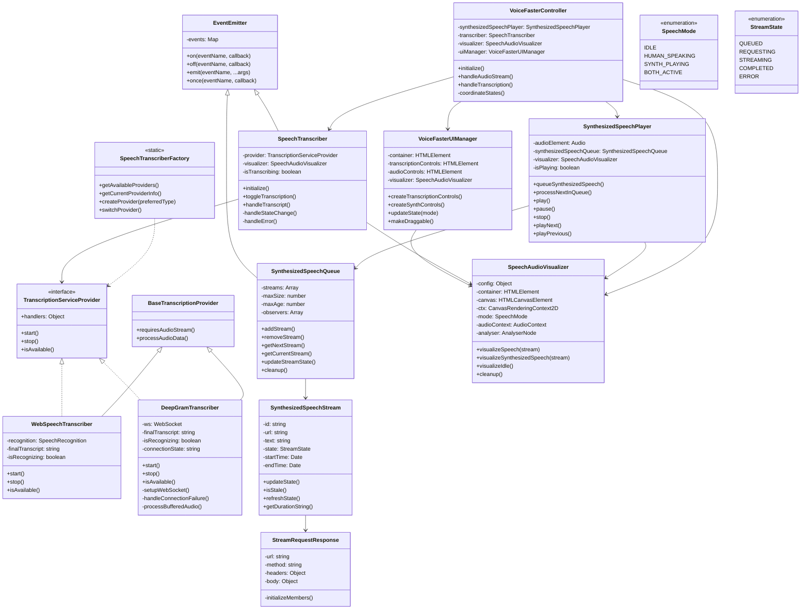

# v2.3 class diagram (proposed, new names)

```mermaid
classDiagram
    %% Core Controller Class
    class VoiceFasterController {
        -synthesizedSpeechPlayer: SynthesizedSpeechPlayer
        -transcriber: SpeechTranscriber
        -visualizer: SpeechAudioVisualizer
        -uiManager: VoiceFasterUIManager
        +initialize()
        +handleAudioStream()
        +handleTranscription()
        -coordinateStates()
    }

    %% Base Classes and Interfaces
    class EventEmitter {
        -events: Map
        +on(eventName, callback)
        +off(eventName, callback)
        +emit(eventName, ...args)
        +once(eventName, callback)
    }

    class BaseTranscriptionProvider {
        +requiresAudioStream()
        +processAudioData()
    }

    %% Transcription Classes
    class TranscriptionServiceProvider {
        <<interface>>
        +start()
        +stop()
        +isAvailable()
        +handlers: Object
    }

    class WebSpeechTranscriber {
        -recognition: SpeechRecognition
        -finalTranscript: string
        -isRecognizing: boolean
        +start()
        +stop()
        +isAvailable()
    }

    class DeepGramTranscriber {
        -ws: WebSocket
        -finalTranscript: string
        -isRecognizing: boolean
        -connectionState: string
        +start()
        +stop()
        +isAvailable()
        -setupWebSocket()
        -handleConnectionFailure()
        -processBufferedAudio()
    }

    class SpeechTranscriberFactory {
        <<static>>
        +getAvailableProviders()
        +getCurrentProviderInfo()
        +createProvider(preferredType)
        +switchProvider()
    }

    %% Audio Classes
    class SynthesizedSpeechPlayer {
        -audioElement: Audio
        -synthesizedSpeechQueue: SynthesizedSpeechQueue
        -visualizer: SpeechAudioVisualizer
        -isPlaying: boolean
        +queueSynthesizedSpeech()
        +processNextInQueue()
        +play()
        +pause()
        +stop()
        +playNext()
        +playPrevious()
    }

    class SynthesizedSpeechQueue {
        -streams: Array
        -maxSize: number
        -maxAge: number
        -observers: Array
        +addStream()
        +removeStream()
        +getNextStream()
        +getCurrentStream()
        +updateStreamState()
        +cleanup()
    }

    class SynthesizedSpeechStream {
        -id: string
        -url: string
        -text: string
        -state: StreamState
        -startTime: Date
        -endTime: Date
        +updateState()
        +isStale()
        +refreshState()
        +getDurationString()
    }

    class StreamRequestResponse {
        -url: string
        -method: string
        -headers: Object
        -body: Object
        -initializeMembers()
    }

    %% Visualization Classes
    class SpeechAudioVisualizer {
        -config: Object
        -container: HTMLElement
        -canvas: HTMLCanvasElement
        -ctx: CanvasRenderingContext2D
        -mode: SpeechMode
        -audioContext: AudioContext
        -analyser: AnalyserNode
        +visualizeSpeech(stream)
        +visualizeSynthesizedSpeech(stream)
        +visualizeIdle()
        +cleanup()
    }

    %% UI Classes
    class VoiceFasterUIManager {
        -container: HTMLElement
        -transcriptionControls: HTMLElement
        -audioControls: HTMLElement
        -visualizer: SpeechAudioVisualizer
        +createTranscriptionControls()
        +createSynthControls()
        +updateState(mode)
        +makeDraggable()
    }

    class SpeechTranscriber {
        -provider: TranscriptionServiceProvider
        -visualizer: SpeechAudioVisualizer
        -isTranscribing: boolean
        +initialize()
        +toggleTranscription()
        +handleTranscript()
        -handleStateChange()
        -handleError()
    }

    %% Enums
    class SpeechMode {
        <<enumeration>>
        IDLE
        HUMAN_SPEAKING
        SYNTH_PLAYING
        BOTH_ACTIVE
    }

    class StreamState {
        <<enumeration>>
        QUEUED
        REQUESTING
        STREAMING
        COMPLETED
        ERROR
    }

    %% Relationships
    VoiceFasterController --> VoiceFasterUIManager
    VoiceFasterController --> SynthesizedSpeechPlayer
    VoiceFasterController --> SpeechTranscriber
    VoiceFasterController --> SpeechAudioVisualizer

    BaseTranscriptionProvider <|-- WebSpeechTranscriber
    BaseTranscriptionProvider <|-- DeepGramTranscriber
    TranscriptionServiceProvider <|.. WebSpeechTranscriber
    TranscriptionServiceProvider <|.. DeepGramTranscriber
    SpeechTranscriberFactory ..> TranscriptionServiceProvider

    SynthesizedSpeechPlayer --> SynthesizedSpeechQueue
    SynthesizedSpeechPlayer --> SpeechAudioVisualizer
    SynthesizedSpeechQueue --> SynthesizedSpeechStream
    SynthesizedSpeechStream --> StreamRequestResponse

    SpeechTranscriber --> TranscriptionServiceProvider
    SpeechTranscriber --> SpeechAudioVisualizer

    VoiceFasterUIManager --> SpeechAudioVisualizer

    EventEmitter <|-- SpeechTranscriber
    EventEmitter <|-- SynthesizedSpeechQueue
```